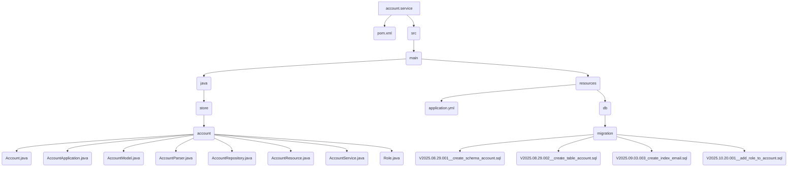

# Account Service

This is the implementation of the Account service. It handles the business logic for managing user accounts.

## File Structure



## Source Code

### pom.xml

```xml
<?xml version="1.0" encoding="UTF-8"?>
<project xmlns="http://maven.apache.org/POM/4.0.0" xmlns:xsi="http://www.w3.org/2001/XMLSchema-instance"
	xsi:schemaLocation="http://maven.apache.org/POM/4.0.0 https://maven.apache.org/xsd/maven-4.0.0.xsd">
	<modelVersion>4.0.0</modelVersion>
	<parent>
		<groupId>org.springframework.boot</groupId>
		<artifactId>spring-boot-starter-parent</artifactId>
		<version>3.5.5</version>
		<relativePath/>
	</parent>

	<groupId>store</groupId>
	<artifactId>account-service</artifactId>
	<version>1.0.0</version>
	
	<properties>
		<java.version>21</java.version>
		<spring-cloud.version>2025.0.0</spring-cloud.version>
		<maven.compiler.proc>full</maven.compiler.proc>
	</properties>

	<dependencies>
		<dependency>
			<groupId>org.springframework.boot</groupId>
			<artifactId>spring-boot-starter-web</artifactId>
		</dependency>

		<dependency>
			<groupId>org.springframework.boot</groupId>
			<artifactId>spring-boot-starter-data-jpa</artifactId>
	    </dependency>

		<dependency>
			<groupId>${project.groupId}</groupId>
			<artifactId>account</artifactId>
			<version>${project.version}</version>
		</dependency>

		<!-- https://mvnrepository.com/artifact/org.projectlombok/lombok -->
		<dependency>
			<groupId>org.projectlombok</groupId>
			<artifactId>lombok</artifactId>
			<optional>true</optional>
		</dependency>

		<dependency>
			<groupId>org.postgresql</groupId>
			<artifactId>postgresql</artifactId>
			<scope>runtime</scope>
	    </dependency>
		<dependency>
			<groupId>org.flywaydb</groupId>
			<artifactId>flyway-core</artifactId>
		</dependency>
		<dependency>
			<groupId>org.flywaydb</groupId>
			<artifactId>flyway-database-postgresql</artifactId>
		</dependency>


	</dependencies>

	<dependencyManagement>
		<dependencies>
			<dependency>
				<groupId>org.springframework.cloud</groupId>
				<artifactId>spring-cloud-dependencies</artifactId>
				<version>${spring-cloud.version}</version>
				<type>pom</type>
				<scope>import</scope>
			</dependency>
		</dependencies>
	</dependencyManagement>

	<build>
		<plugins>
			<plugin>
				<groupId>org.springframework.boot</groupId>
				<artifactId>spring-boot-maven-plugin</artifactId>
				<configuration>
					<excludes>
						<exclude>
							<groupId>org.projectlombok</groupId>
							<artifactId>lombok</artifactId>
						</exclude>
					</excludes>
				</configuration>
			</plugin>
		</plugins>
	</build>

</project>
```

### AccountService.java

```java
package store.account;

import java.nio.charset.StandardCharsets;
import java.security.MessageDigest;
import java.security.NoSuchAlgorithmException;
import java.util.Base64;
import java.util.List;
import java.util.stream.StreamSupport;

import org.slf4j.Logger;
import org.slf4j.LoggerFactory;
import org.springframework.beans.factory.annotation.Autowired;
import org.springframework.http.HttpStatus;
import org.springframework.stereotype.Service;
import org.springframework.web.server.ResponseStatusException;

@Service
public class AccountService {

    private Logger looger = LoggerFactory.getLogger(AccountService.class);

    @Autowired
    private AccountRepository accountRepository;

    public Account create(Account account) {
        if (null == account.password()) {
            throw new ResponseStatusException(HttpStatus.BAD_REQUEST,
                "Password is mandatory!"
            );
        }
        // clean special caracters
        account.password(account.password().trim());
        if (account.password().length() < 4) {
            throw new ResponseStatusException(HttpStatus.BAD_REQUEST,
                "Password is too short!"
            );
        }
        if (null == account.email()) {
            throw new ResponseStatusException(HttpStatus.BAD_REQUEST,
                "Email is mandatory!"
            );
        }

        if (accountRepository.findByEmail(account.email()) != null)
            throw new ResponseStatusException(HttpStatus.BAD_REQUEST,
                "Email already have been registered!"
            );

        account.sha256(hash(account.password()));

        // set default role
        account.role(Role.USER);

        return accountRepository.save(
            new AccountModel(account)
        ).to();
    }

    public List<Account> findAll() {
        return StreamSupport.stream(
            accountRepository.findAll().spliterator(), false)
            .map(AccountModel::to)
            .toList();
    }

    public Account findById(String id) {
        return accountRepository.findById(id).map(AccountModel::to).orElse(null);
    }

    public Account findByEmailAndPassword(String email, String password) {
        String sha256 = hash(password);
        return accountRepository.findByEmailAndSha256(email, sha256).map(AccountModel::to).orElse(null);
    }

    public void delete(String id) {
        accountRepository.delete(accountRepository.findById(id).orElseThrow(() ->
            new ResponseStatusException(HttpStatus.NOT_FOUND, "Account not found!")
        ));
    }

    private String hash(String pass) {
        try {
            MessageDigest digest = MessageDigest.getInstance("SHA-256");
            byte[] encodedHash = digest.digest(
                pass.getBytes(StandardCharsets.UTF_8)
            );
            return Base64.getEncoder().encodeToString(encodedHash);
        } catch (NoSuchAlgorithmException e) {
            throw new ResponseStatusException(HttpStatus.INTERNAL_SERVER_ERROR, e.getMessage(), e);
        }
    }
    
}
```
