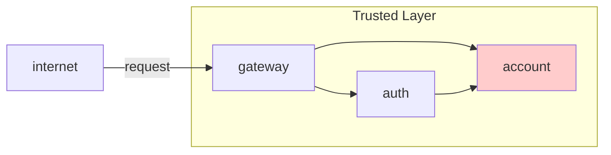
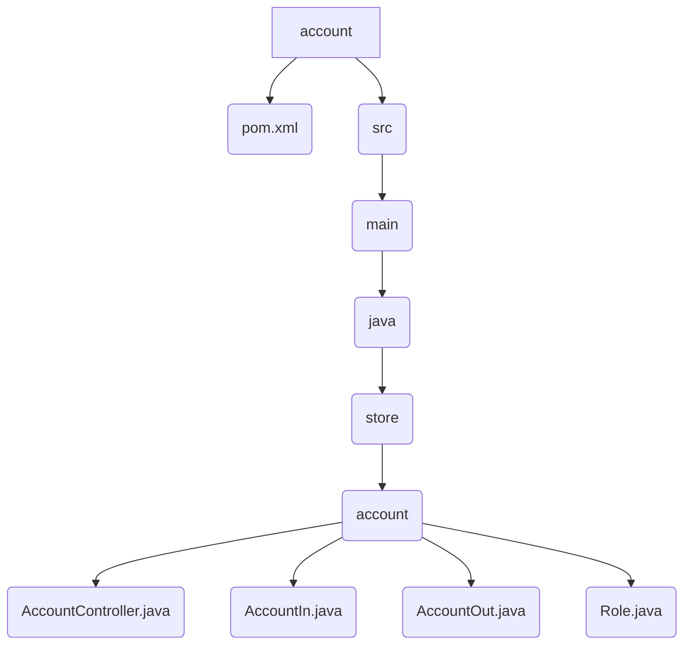

# Account API

The `account` API defines the contract for interacting with the account service. It's an interface used by other services, like the gateway, to communicate with the account management backend. It uses OpenFeign for declarative REST client creation.



## Endpoints

The API exposes the following endpoints:

!!! info "POST /account"
    Creates a new user account.

    === "Request"
        ```json
        {
          "name": "John Doe",
          "email": "john.doe@example.com",
          "password": "password123"
        }
        ```

    === "Response (201 Created)"
        ```json
        {
          "id": "generated-uuid",
          "name": "John Doe",
          "email": "john.doe@example.com",
          "role": "USER"
        }
        ```

---

!!! info "POST /account/login"
    Authenticates a user and returns their details.

    === "Request"
        ```json
        {
          "email": "john.doe@example.com",
          "password": "password123"
        }
        ```

    === "Response (200 OK)"
        ```json
        {
          "id": "user-uuid",
          "name": "John Doe",
          "email": "john.doe@example.com",
          "role": "USER"
        }
        ```

---

!!! info "GET /account"
    Retrieves a list of all user accounts.

    === "Response (200 OK)"
        ```json
        [
          {
            "id": "user-uuid-1",
            "name": "John Doe",
            "email": "john.doe@example.com",
            "role": "USER"
          },
          {
            "id": "user-uuid-2",
            "name": "Jane Smith",
            "email": "jane.smith@example.com",
            "role": "ADMIN"
          }
        ]
        ```

---

!!! info "GET /account/{id}"
    Retrieves a specific user account by its ID.

    === "Response (200 OK)"
        ```json
        {
          "id": "user-uuid",
          "name": "John Doe",
          "email": "john.doe@example.com",
          "role": "USER"
        }
        ```

---

!!! info "GET /account/whoami"
    Retrieves the account details of the currently authenticated user, based on the `id-account` header.

    === "Response (200 OK)"
        ```json
        {
          "id": "user-uuid",
          "name": "John Doe",
          "email": "john.doe@example.com",
          "role": "USER"
        }
        ```
---

!!! info "DELETE /account/{id}"
    Deletes a user account by its ID.

    === "Response (204 No Content)"
        ```
        (No response body)
        ```

## File Structure


## pom.xml
```xml
<?xml version="1.0" encoding="UTF-8"?>
<project xmlns="http://maven.apache.org/POM/4.0.0" xmlns:xsi="http://www.w3.org/2001/XMLSchema-instance"
    xsi:schemaLocation="http://maven.apache.org/POM/4.0.0 https://maven.apache.org/xsd/maven-4.0.0.xsd">
    <modelVersion>4.0.0</modelVersion>
    <parent>
        <groupId>org.springframework.boot</groupId>
        <artifactId>spring-boot-starter-parent</artifactId>
        <version>3.5.5</version>
        <relativePath/>
    </parent>

    <groupId>store</groupId>
    <artifactId>account</artifactId>
    <version>1.0.0</version>

    <properties>
        <java.version>21</java.version>
        <spring-cloud.version>2025.0.0</spring-cloud.version>
        <maven.compiler.proc>full</maven.compiler.proc>
    </properties>

    <dependencies>
        <dependency>
            <groupId>org.springframework.boot</groupId>
            <artifactId>spring-boot-starter-web</artifactId>
        </dependency>
        <dependency>
            <groupId>org.springframework.cloud</groupId>
            <artifactId>spring-cloud-starter-openfeign</artifactId>
        </dependency>

        <dependency>
            <groupId>org.projectlombok</groupId>
            <artifactId>lombok</artifactId>
            <optional>true</optional>
        </dependency>
    </dependencies>

    <dependencyManagement>
        <dependencies>
            <dependency>
                <groupId>org.springframework.cloud</groupId>
                <artifactId>spring-cloud-dependencies</artifactId>
                <version>${spring-cloud.version}</version>
                <type>pom</type>
                <scope>import</scope>
            </dependency>
        </dependencies>
    </dependencyManagement>

</project>
```