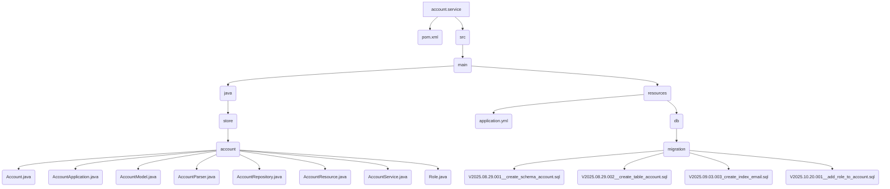

# Account Service

This service provides the concrete implementation for the Account API. It handles all business logic related to user accounts, including creation, authentication, and data persistence.



## Features

-   **User Management**: Handles creation, retrieval, and deletion of user accounts.
-   **Authentication**: Validates user credentials by checking email and hashed password.
-   **Password Hashing**: Securely stores passwords by hashing them with SHA-256.
-   **Database Persistence**: Uses Spring Data JPA and PostgreSQL to store account data.
-   **Database Migrations**: Manages database schema evolution using Flyway.

## Dockerfile
```dockerfile
FROM openjdk:23-slim
VOLUME /tmp
COPY target/*.jar app.jar
ENTRYPOINT ["java","-jar","/app.jar"]
```

## Jenkinsfile
```groovy
pipeline {
    agent any
    environment {
        SERVICE = 'account'
        NAME = "luigilopesz/${env.SERVICE}"
    }
    stages {
        stage('Dependencies') {
            steps {
                build job: 'account', wait: true
            }
        }
        stage('Build') { 
            steps {
                sh 'mvn -B -DskipTests clean package'
            }
        }      
        stage('Build & Push Image') {
            steps {
                withCredentials([usernamePassword(
                    credentialsId: 'dockerhub-credential',
                    usernameVariable: 'USERNAME',
                    passwordVariable: 'TOKEN')])
                {
                    sh "docker login -u $USERNAME -p $TOKEN"
                    sh "docker buildx create --use --platform=linux/arm64,linux/amd64 --node multi-platform-builder-${env.SERVICE} --name multi-platform-builder-${env.SERVICE}"
                    sh "docker buildx build --platform=linux/arm64,linux/amd64 --push --tag ${env.NAME}:latest --tag ${env.NAME}:${env.BUILD_ID} -f Dockerfile ."
                    sh "docker buildx rm --force multi-platform-builder-${env.SERVICE}"
                }
            }
        }
    }
}
```

## Database Migrations

The database schema is managed by Flyway with these migrations:

- **V2025.08.29.001**: Creates the `account` schema.
- **V2025.08.29.002**: Creates the `account` table with `id`, `name`, `email`, and `sha256` columns.
- **V2025.09.03.003**: Adds an index on the `email` column for faster lookups.
- **V2025.10.20.001**: Adds the `role` column to the `account` table.