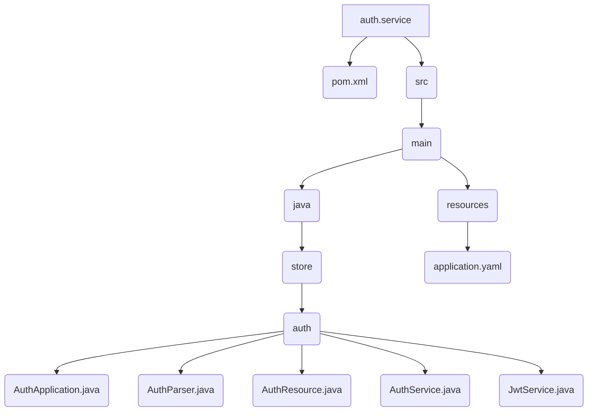

# Auth Service

This is the implementation of the Auth service. It handles the business logic for user authentication and authorization.

## File Structure



## Source Code

### pom.xml

```xml
<?xml version="1.0" encoding="UTF-8"?>
<project xmlns="http://maven.apache.org/POM/4.0.0" xmlns:xsi="http://www.w3.org/2001/XMLSchema-instance"
	xsi:schemaLocation="http://maven.apache.org/POM/4.0.0 https://maven.apache.org/xsd/maven-4.0.0.xsd">
	<modelVersion>4.0.0</modelVersion>
	<parent>
		<groupId>org.springframework.boot</groupId>
		<artifactId>spring-boot-starter-parent</artifactId>
		<version>3.5.5</version>
		<relativePath/>
	</parent>

	<groupId>store</groupId>
	<artifactId>auth-service</artifactId>
	<version>1.0.0</version>
	
	<properties>
		<java.version>21</java.version>
		<spring-cloud.version>2025.0.0</spring-cloud.version>
		<maven.compiler.proc>full</maven.compiler.proc>
	</properties>

	<dependencies>
		<dependency>
			<groupId>org.springframework.boot</groupId>
			<artifactId>spring-boot-starter-web</artifactId>
		</dependency>
		<dependency>
			<groupId>org.springframework.cloud</groupId>
			<artifactId>spring-cloud-starter-openfeign</artifactId>
		</dependency>

		<dependency>
			<groupId>${project.groupId}</groupId>
			<artifactId>auth</artifactId>
			<version>${project.version}</version>
		</dependency>
		<dependency>
			<groupId>${project.groupId}</groupId>
			<artifactId>account</artifactId>
			<version>${project.version}</version>
		</dependency>

		<!-- https://mvnrepository.com/artifact/org.projectlombok/lombok -->
		<dependency>
			<groupId>org.projectlombok</groupId>
			<artifactId>lombok</artifactId>
			<optional>true</optional>
		</dependency>

		<!-- https://mvnrepository.com/artifact/io.jsonwebtoken/jjwt-api -->
		<dependency>
			<groupId>io.jsonwebtoken</groupId>
			<artifactId>jjwt-api</artifactId>
			<version>[0.13,)</version>
		</dependency>
        <dependency>
            <groupId>io.jsonwebtoken</groupId>
            <artifactId>jjwt-impl</artifactId>
			<version>[0.13,)</version>
            <scope>runtime</scope>
        </dependency>
		<dependency>
			<groupId>io.jsonwebtoken</groupId>
			<artifactId>jjwt-jackson</artifactId> <!-- or jjwt-gson if Gson is preferred -->
			<version>[0.13,)</version>
			<scope>runtime</scope>
		</dependency>

	</dependencies>

	<dependencyManagement>
		<dependencies>
			<dependency>
				<groupId>org.springframework.cloud</groupId>
				<artifactId>spring-cloud-dependencies</artifactId>
				<version>${spring-cloud.version}</version>
				<type>pom</type>
				<scope>import</scope>
			</dependency>
		</dependencies>
	</dependencyManagement>

	<build>
		<plugins>
			<plugin>
				<groupId>org.springframework.boot</groupId>
				<artifactId>spring-boot-maven-plugin</artifactId>
				<configuration>
					<excludes>
						<exclude>
							<groupId>org.projectlombok</groupId>
							<artifactId>lombok</artifactId>
						</exclude>
					</excludes>
				</configuration>
			</plugin>
		</plugins>
	</build>

</project>
```

### AuthService.java

```java
package store.auth;

import org.slf4j.Logger;
import org.slf4j.LoggerFactory;
import org.springframework.beans.factory.annotation.Autowired;
import org.springframework.http.HttpStatus;
import org.springframework.http.ResponseEntity;
import org.springframework.stereotype.Service;
import org.springframework.web.server.ResponseStatusException;

import store.account.AccountController;
import store.account.AccountIn;
import store.account.AccountOut;
import store.account.Role;

@Service
public class AuthService {

    private Logger logger = LoggerFactory.getLogger(AuthService.class);

    @Autowired
    private AccountController accountController;

    @Autowired
    private JwtService jwtService;

    public String register(String name, String email, String password) {

        logger.debug(
            String.format(
                "registrando uma conta: [%s] for [%s]",
                name, email
            )
        );

        // Salvar no servico de Account
        AccountOut account = accountController.create(AccountIn.builder()
            .name(name)
            .email(email)
            .password(password)
            .build()
        ).getBody();

        // Gera um token
        String jwtString = jwtService.generate(account);

        // Retorna o token
        return jwtString;
    }

    public String login(String email, String password) {

        logger.debug(String.format("required login for %s:%s", email, password));

        // Verify credentials
        ResponseEntity<AccountOut> response = accountController.findByEmailAndPassword(
            AccountIn.builder()
                .email(email)
                .password(password)
                .build()
        );
        if (!response.hasBody()) {
            logger.debug(String.format("user not found"));
            throw new ResponseStatusException(HttpStatus.UNAUTHORIZED);
        }

        AccountOut account = response.getBody();
        logger.debug(String.format("found user", account));

        // generate token
        return jwtService.generate(account);
    }

    public AccountOut solve(String jwt) {
        return AccountOut.builder()
            .id(jwtService.getId(jwt))
            .role(Role.valueOf(jwtService.getRole(jwt)))
            .build();
    }

}
```

### JwtService.java

```java
package store.auth;

import java.util.Date;
import java.util.Map;

import javax.crypto.SecretKey;

import org.springframework.beans.factory.annotation.Value;
import org.springframework.http.HttpStatus;
import org.springframework.stereotype.Service;
import org.springframework.web.server.ResponseStatusException;

import io.jsonwebtoken.Claims;
import io.jsonwebtoken.JwtParser;
import io.jsonwebtoken.Jwts;
import io.jsonwebtoken.io.Decoders;
import io.jsonwebtoken.security.Keys;
import store.account.AccountOut;

@Service
public class JwtService {

    @Value("${store.jwt.secretKey}")
    private String secretKey;

    public String generate(AccountOut account) {

        Date now = new Date();

        String jwt = Jwts.builder()
            .header()
            .and()
            .id(account.id())
            .issuer("Insper::PMA")
            .claims(Map.of(
                "email", account.email(),
                "role", account.role()
            ))
            .signWith(getKey())
            .subject(account.name())
            .notBefore(now)
            .expiration(new Date(now.getTime() + 1000 * 60 * 120)) // em milisegundos
            .compact();
        return jwt;

    }

    public String getId(String jwt) {
        return getClaims(jwt).getId();
    }

    public String getRole(String jwt) {
        return getClaims(jwt).get("role", String.class);
    }

    private Claims getClaims(String jwt) {
        // constroe o parser
        JwtParser parser = Jwts.parser().verifyWith(getKey()).build();
        // recupero os atributos
        Claims claims = parser.parseSignedClaims(jwt).getPayload();
        Date now = new Date();
        if (claims.getNotBefore().after(now)) {
            throw new ResponseStatusException(
                HttpStatus.UNAUTHORIZED,
                "Token is not valid yet!"
            );
        }
        if (claims.getExpiration().before(now)) {
            throw new ResponseStatusException(
                HttpStatus.UNAUTHORIZED,
                "Token is expired!"
            );
        }
        return claims;
    }

    private SecretKey getKey() {
        return Keys.hmacShaKeyFor(Decoders.BASE64.decode(secretKey));
    }
    
}
```
