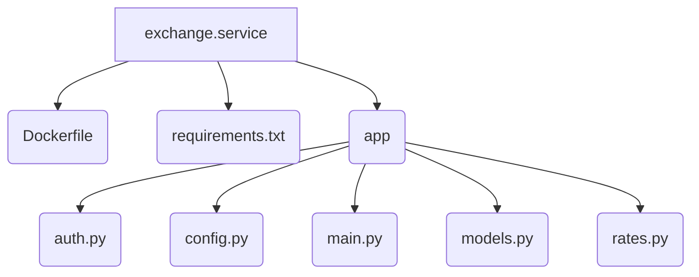

# Exchange Service

This is the implementation of the Exchange service. It provides exchange rates for different currencies.

## File Structure



## Source Code

### Dockerfile

```dockerfile
FROM python:3.12-slim

WORKDIR /app
COPY requirements.txt .
RUN pip install --no-cache-dir -r requirements.txt

COPY app ./app

ENV EXCHANGE_PORT=8080
EXPOSE 8080

CMD ["uvicorn", "app.main:app", "--host", "0.0.0.0", "--port", "8080"]
```

### requirements.txt

```
fastapi
uvicorn
httpx
pyjwt
pydantic-settings
```

### main.py

```python
from fastapi import FastAPI, Depends, HTTPException
from .auth import require_auth
from .rates import get_exchange_rate
from .models import ExchangeResponse, ErrorResponse
from .config import settings

app = FastAPI(title="Exchange Service", version="1.0.0")


@app.get(
    "/exchange/{base}/{target}",
    response_model=ExchangeResponse,
    responses={
        400: {
            "model": ErrorResponse
        },
        401: {
            "model": ErrorResponse
        }
    },
)
async def exchange_rate(base: str,
                        target: str,
                        account_id: str = Depends(require_auth)):
    rate_data = await get_exchange_rate(base, target)

    if not rate_data:
        raise HTTPException(status_code=400,
                            detail=f"Invalid currency pair {base}/{target}")

    return rate_data
```
