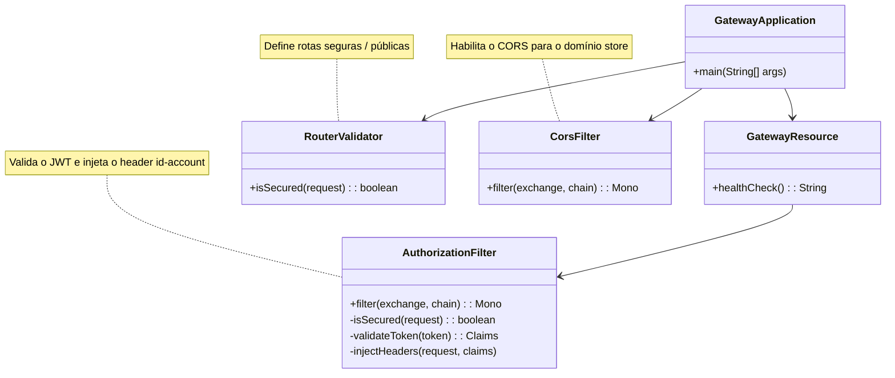

# Gateway API

A **Gateway API** atua como ponto único de entrada para todos os microserviços do domínio `store`.  
Ela é responsável por rotear, autenticar e auditar requisições externas, aplicando políticas de segurança e balanceando o tráfego entre os serviços internos.

!!! info "Trusted layer e segurança"
    Toda requisição externa **entra exclusivamente pelo Gateway**.  
    O Gateway valida o **JWT**, injeta o `id-account` nos headers e redireciona a requisição para o microserviço correspondente (account, auth, order, product, exchange etc.).  

---

## Visão geral

- **Service (`gateway.service`)**: Implementado em **Spring Cloud Gateway (Java)**.  
  Centraliza o roteamento HTTP para os demais microserviços (`account`, `auth`, `order`, `product`, `exchange`).  
  Aplica as regras de segurança via filtros customizados e validação de tokens JWT.  

- **Segurança e Autorização**  
  Toda requisição passa por `AuthorizationFilter`, que valida o JWT e injeta o header `id-account` antes do encaminhamento ao destino.  
  O `RouterValidator` define quais rotas exigem autenticação.  
  O `CorsFilter` habilita o compartilhamento seguro entre domínios (CORS).



## Estrutura da requisição

``` mermaid
flowchart LR
    subgraph api [Trusted Layer]
        direction TB
        gateway e2 @==>|""| account
        gateway e4 @==>|""| others
        account --> db@{ shape: cyl, label: "Database" }
        others --> db
    end
    internet e1@==>|request| gateway:::red
    e1@{ animate: true }
    e2@{ animate: true }
    e4@{ animate: true }
    classDef red fill:#fcc
```

## gateway.service

``` tree
api
    gateway.service/
        k8s/
            k8s.yaml
        src/
            main/
                java/
                    store/
                        gateway/
                            GatewayApplication.java
                            GatewayResource.java
                            security
                                CorsFilter.java
                                AuthorizationFilter.java
                                RouterValidator.java
                resources/
                    application.yaml
        pom.xml
        Dockerfile
        Jenkinsfile
```

??? info "Source"

    === "pom.xml"

        ``` { .yaml .copy .select linenums="1" }
        --8<-- "https://raw.githubusercontent.com/microservices-architecture-example/gateway.service/refs/heads/main/pom.xml"
        ```

    === "Dockerfile"

        ``` { .dockerfile .copy .select linenums="1" }
        --8<-- "https://raw.githubusercontent.com/microservices-architecture-example/gateway.service/refs/heads/main/Dockerfile"
        ```

    === "Jenkinsfile"

        ``` { .jenkinsfile .copy .select linenums="1" }
        --8<-- "https://raw.githubusercontent.com/microservices-architecture-example/gateway.service/refs/heads/main/Jenkinsfile"
        ```

    === "k8s.yaml"

        ``` { .yaml .copy .select linenums="1" }
        --8<-- "https://raw.githubusercontent.com/microservices-architecture-example/gateway.service/refs/heads/main/k8s/k8s.yaml"
        ```

    === "application.yaml"

        ``` { .yaml .copy .select linenums="1" }
        --8<-- "https://raw.githubusercontent.com/microservices-architecture-example/gateway.service/refs/heads/main/src/main/resources/application.yaml"
        ```

    === "GatewayApplication.java"

        ``` { .java .copy .select linenums='1' }
        --8<-- "https://raw.githubusercontent.com/microservices-architecture-example/gateway.service/refs/heads/main/src/main/java/store/gateway/GatewayApplication.java"
        ```

    === "GatewayResource.java"

        ``` { .java .copy .select linenums='1' }
        --8<-- "https://raw.githubusercontent.com/microservices-architecture-example/gateway.service/refs/heads/main/src/main/java/store/gateway/GatewayResource.java"
        ```

    === "CorsFilter.java"

        ``` { .java .copy .select linenums='1' }
        --8<-- "https://raw.githubusercontent.com/microservices-architecture-example/gateway.service/refs/heads/main/src/main/java/store/gateway/security/CorsFilter.java"
        ```

    === "AuthorizationFilter.java"

        ``` { .java .copy .select linenums='1' }
        --8<-- "https://raw.githubusercontent.com/microservices-architecture-example/gateway.service/refs/heads/main/src/main/java/store/gateway/security/AuthorizationFilter.java"
        ```

    === "RouterValidator.java"

        ``` { .java .copy .select linenums='1' }
        --8<-- "https://raw.githubusercontent.com/microservices-architecture-example/gateway.service/refs/heads/main/src/main/java/store/gateway/security/RouterValidator.java"
        ```

<!-- termynal -->

``` { bash }
> mvn clean package spring-boot:run
```