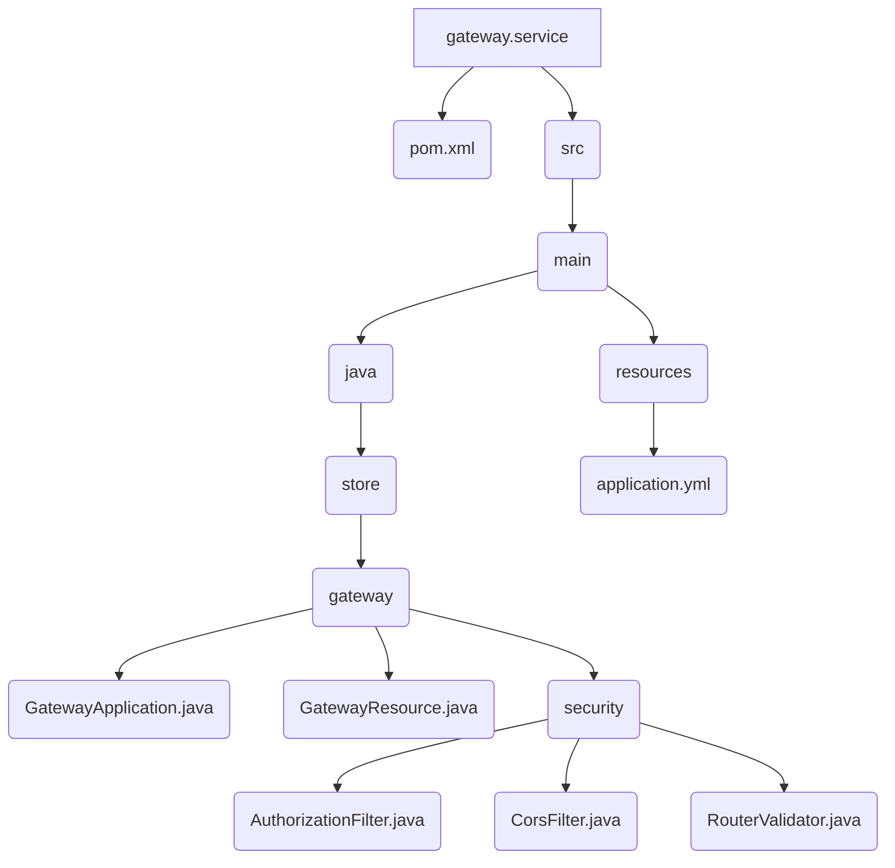

# Gateway Service

This is the implementation of the Gateway service. It acts as an API gateway, routing requests to the appropriate downstream service.

## File Structure



## Source Code

### pom.xml

```xml
<?xml version="1.0" encoding="UTF-8"?>
<project xmlns="http://maven.apache.org/POM/4.0.0"
	xmlns:xsi="http://www.w3.org/2001/XMLSchema-instance"
	xsi:schemaLocation="http://maven.apache.org/POM/4.0.0 https://maven.apache.org/xsd/maven-4.0.0.xsd">
	<modelVersion>4.0.0</modelVersion>
	<parent>
		<groupId>org.springframework.boot</groupId>
		<artifactId>spring-boot-starter-parent</artifactId>
		<version>3.5.5</version>
		<relativePath /> <!-- lookup parent from repository -->
	</parent>
	<groupId>store</groupId>
	<artifactId>gateway-service</artifactId>
	<version>1.0.0</version>
	<properties>
		<java.version>21</java.version>
		<spring-cloud.version>2025.0.0</spring-cloud.version>
		<maven.compiler.proc>full</maven.compiler.proc>
	</properties>
	<dependencies>
		<dependency>
			<groupId>org.springframework.boot</groupId>
			<artifactId>spring-boot-starter-webflux</artifactId>
		</dependency>
		<dependency>
			<groupId>org.springframework.cloud</groupId>
			<artifactId>spring-cloud-starter-gateway-server-webflux</artifactId>
		</dependency>

		<dependency>
			<groupId>org.projectlombok</groupId>
			<artifactId>lombok</artifactId>
			<optional>true</optional>
		</dependency>

	</dependencies>

	<dependencyManagement>
		<dependencies>
			<dependency>
				<groupId>org.springframework.cloud</groupId>
				<artifactId>spring-cloud-dependencies</artifactId>
				<version>${spring-cloud.version}</version>
				<type>pom</type>
				<scope>import</scope>
			</dependency>
		</dependencies>
	</dependencyManagement>

	<build>
		<plugins>
			<plugin>
				<groupId>org.springframework.boot</groupId>
				<artifactId>spring-boot-maven-plugin</artifactId>
				<configuration>
					<excludes>
						<exclude>
							<groupId>org.projectlombok</groupId>
							<artifactId>lombok</artifactId>
						</exclude>
					</excludes>
				</configuration>
			</plugin>
		</plugins>
	</build>

</project>
```

### AuthorizationFilter.java

```java
package store.gateway.security;

import java.util.Map;

import org.slf4j.Logger;
import org.slf4j.LoggerFactory;
import org.springframework.beans.factory.annotation.Autowired;
import org.springframework.cloud.gateway.filter.GatewayFilterChain;
import org.springframework.cloud.gateway.filter.GlobalFilter;
import org.springframework.http.HttpHeaders;
import org.springframework.http.HttpStatus;
import org.springframework.http.MediaType;
import org.springframework.http.server.reactive.ServerHttpRequest;
import org.springframework.stereotype.Component;
import org.springframework.web.reactive.function.client.WebClient;
import org.springframework.web.server.ResponseStatusException;
import org.springframework.web.server.ServerWebExchange;

import reactor.core.publisher.Mono;

@Component
public class AuthorizationFilter implements GlobalFilter {

    private Logger logger = LoggerFactory.getLogger(AuthorizationFilter.class);
    private static final String AUTHORIZATION_HEADER = "Authorization";
    private static final String AUTHORIZATION_BEARER_HEADER = "Bearer";
    private static final String AUTH_SERVICE_TOKEN_SOLVE = "http://auth:8080/auth/solve";

    @Autowired
    private RouterValidator routerValidator;

    @Autowired
    private WebClient.Builder webClient;

    @Override
    public Mono<Void> filter(ServerWebExchange exchange, GatewayFilterChain chain) {
        logger.debug("filter: entrou no filtro de autorizacao");
        ServerHttpRequest request = exchange.getRequest();

        if (!routerValidator.isSecured.test(request)) {
            logger.debug("filter: rota nao eh segura");
            return chain.filter(exchange);
        }
        logger.debug("filter: rota eh segura");

        if (!isAuthMissing(request)) {
            logger.debug("filter: tem [Authorization] no Header");
            String authorization = request.getHeaders().get(AUTHORIZATION_HEADER).get(0);
            logger.debug(String.format(
                "filter: [Authorization]=[%s]",
                authorization
            ));
            String[] parts = authorization.split(" ");
            if (parts.length != 2) {
                logger.debug("filter: bearer token is invalid");
                throw new ResponseStatusException(HttpStatus.UNAUTHORIZED, "Authorization header is not well formatted");
            }
            if (!AUTHORIZATION_BEARER_HEADER.equals(parts[0])) {
                logger.debug("filter: bearer token is invalid");
                throw new ResponseStatusException(HttpStatus.UNAUTHORIZED, "Authorization header is not well formatted");
            }
            logger.debug("filter: bearer token is formatted");

            final String jwt = parts[1];

            return requestAuthTokenSolve(exchange, chain, jwt);

        }
        logger.debug("filter: access is denied!");
        // if access is denied
        throw new ResponseStatusException(HttpStatus.UNAUTHORIZED);
    }

    private boolean isAuthMissing(ServerHttpRequest request) {
        return !request.getHeaders().containsKey(AUTHORIZATION_HEADER);
    }
    
    // este metodo eh responsavel por enviar o token ao Auth Microservice
    // a fim de interpretar o token, a chamada eh feita via Rest.
    private Mono<Void> requestAuthTokenSolve(ServerWebExchange exchange, GatewayFilterChain chain, String jwt) {
        logger.debug("solve: solving jwt: " + jwt);
        return webClient
            .defaultHeader(
                HttpHeaders.CONTENT_TYPE, MediaType.APPLICATION_JSON_VALUE
            )
            .build()
            .post()
            .uri(AUTH_SERVICE_TOKEN_SOLVE)
            .bodyValue(Map.of(
                "jwt", jwt)
            )
            .retrieve()
            .toEntity(Map.class)
            .flatMap(response -> {
                if (response != null && response.hasBody() && response.getBody() != null) {
                    final Map<String, String> map = response.getBody();
                    String accountId = map.get("AccountId");
                    String role = map.get("role");
                    logger.debug("solve: id account: " + accountId);
                    logger.debug("solve: role account: " + role);
                    ServerWebExchange authorizated = updateRequest(exchange, accountId, role);
                    return chain.filter(authorizated);
                } else {
                    throw new ResponseStatusException(HttpStatus.UNAUTHORIZED, "Invalid token");
                }
            });
    }

    private ServerWebExchange updateRequest(ServerWebExchange exchange, String idAccount, String role) {
        logger.debug("original headers: " + exchange.getRequest().getHeaders().toString());
        ServerWebExchange modified = exchange.mutate()
            .request(
                exchange.getRequest()
                    .mutate()
                    .header("id-account", idAccount)
                    .header("role-account", role)
                    .build()
            ).build();
        logger.debug("updated headers: " + modified.getRequest().getHeaders().toString());
        return modified;
    }    

}
```
