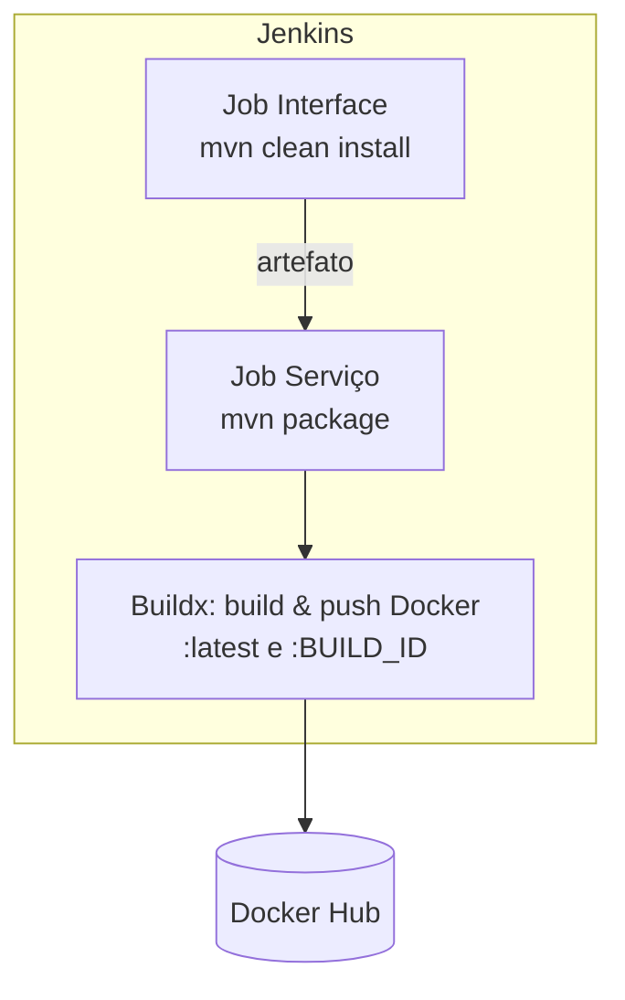

# Jenkins CI/CD – Store Project

A esteira de **CI/CD** do domínio `store` é orquestrada pelo **Jenkins**.  
Existem **dois tipos de pipelines**:

1) **Interfaces** (`account`, `auth`, `product`, `order`):  
   - Empacotam artefatos/contratos usados por outros módulos.  
   - **Não** publicam imagem Docker.  
   - Passos: `mvn -B -DskipTests clean install`.

2) **Serviços** (`account.service`, `auth.service`, `product.service`, `order.service`, `gateway.service`, `exchange.service`):  
   - Build Java ou Python (conforme o serviço).  
   - **Build & push** de imagem Docker (multi-arch) para o Docker Hub.  
   - Podem acionar **jobs de dependência** (ex.: compilar a interface antes).

---

## Status atual dos pipelines

A captura abaixo mostra o painel do Jenkins com os últimos runs de todas as pipelines ativas:


---

## Padrões de pipeline

### 1) Interfaces – apenas build Maven

```groovy
pipeline {
    agent any

    stages {
        stage('Build') {
            steps {
                sh 'mvn -B -DskipTests clean install'
            }
        }
    }
}
```

**Objetivo:** disponibilizar artefatos (JARs) para que os serviços possam compilar contra as últimas mudanças de contrato/DTOs.

---


### 2) Serviços – build, dependências e imagem Docker

```groovy
pipeline {
    agent any
    environment {
        SERVICE = <nome_serviço>            // nome lógico do serviço
        NAME = "microservices-architecture-example/${env.SERVICE}"   // repositório de imagem no Docker Hub
    }
    stages {
        stage('Dependecies') {
            steps {
                // dispara o job da interface correspondente e aguarda concluir
                build job: <nome_interface>, wait: true
            }
        }
        stage('Build') { 
            steps {
                sh 'mvn -B -DskipTests clean package'
            }
        }      
        stage('Build & Push Image') {
            steps {
                withCredentials([usernamePassword(
                    credentialsId: 'dockerhub-credential',
                    usernameVariable: 'USERNAME',
                    passwordVariable: 'TOKEN')]) {
                    sh "docker login -u $USERNAME -p $TOKEN"

                    // builder multi-arch efêmero
                    sh "docker buildx create --use --platform=linux/arm64,linux/amd64 --node multi-platform-builder-${env.SERVICE} --name multi-platform-builder-${env.SERVICE}"

                    // build + push tags :latest e :BUILD_ID
                    sh "docker buildx build --platform=linux/arm64,linux/amd64 --push --tag ${env.NAME}:latest --tag ${env.NAME}:${env.BUILD_ID} -f Dockerfile ."

                    // limpeza do builder
                    sh "docker buildx rm --force multi-platform-builder-${env.SERVICE}"
                }
            }
        }
    }
}
```

**Objetivo:** gerar imagem Docker pronta para deploy (multi-arch), com versionamento por `BUILD_ID` e tag `latest`.

---

## Fluxo resumido



---

## Localização dos Jenkinsfiles

Os `Jenkinsfile` de cada componente estão **nas documentações das respectivas APIs**: 

| Componente         | Documentação                                       |
|--------------------|----------------------------------------------------|
| Account (interface)| [Account API](../account/account.md)               |
| Account.service    | [Account API](../account/account.md)               |
| Auth (interface)   | [Auth API](../auth/auth.md)                     |
| Auth.service       | [Auth API](../auth/auth.md)                     |
| Gateway.service    | [Gateway API](../gateway/gateway.md)               |
| Product (interface)| [Product API](../product/product.md)               |
| Product.service    | [Product API](../product/product.service.md)               |
| Order (interface)  | [Order API](../order/order.md)                   |
| Order.service      | [Order API](../order/order.service.md)                   |
| Exchange.service   | [Exchange API](../exchange/exchange.md)            |


> Cada página detalha o `Jenkinsfile` correspondente via bloco **Source**.

---

## Notas operacionais

- **Credenciais**: o push de imagens usa o secret `dockerhub-credential` (usuário/senha).  
- **Multi-arch**: as imagens são publicadas para `linux/amd64` e `linux/arm64` via `buildx`.  
- **Dependências**: serviços disparam o job da interface para garantir que compilam contra a versão mais recente dos contratos.  

---

✅ *Este documento confirma que todos os pipelines necessários estão configurados e operando conforme o desenho do projeto: interfaces compilam artefatos; serviços geram e publicam imagens Docker.*
