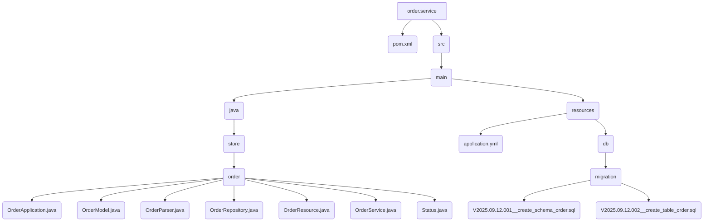

# Order Service

This is the implementation of the Order service. It handles the business logic for managing user orders.

## File Structure



## Source Code

### pom.xml

```xml
<?xml version="1.0" encoding="UTF-8"?>
<project xmlns="http://maven.apache.org/POM/4.0.0" xmlns:xsi="http://www.w3.org/2001/XMLSchema-instance"
	xsi:schemaLocation="http://maven.apache.org/POM/4.0.0 https://maven.apache.org/xsd/maven-4.0.0.xsd">
	<modelVersion>4.0.0</modelVersion>
	<parent>
		<groupId>org.springframework.boot</groupId>
		<artifactId>spring-boot-starter-parent</artifactId>
		<version>3.5.5</version>
		<relativePath/>
	</parent>

	<groupId>store</groupId>
	<artifactId>order-service</artifactId>
	<version>1.0.0</version>
	
	<properties>
		<java.version>21</java.version>
		<spring-cloud.version>2025.0.0</spring-cloud.version>
		<maven.compiler.proc>full</maven.compiler.proc>
	</properties>

	<dependencies>
		<dependency>
			<groupId>org.springframework.boot</groupId>
			<artifactId>spring-boot-starter-web</artifactId>
		</dependency>

		<dependency>
			<groupId>org.springframework.boot</groupId>
			<artifactId>spring-boot-starter-data-jpa</artifactId>
	    </dependency>

		<dependency>
			<groupId>${project.groupId}</groupId>
			<artifactId>order</artifactId>
			<version>${project.version}</version>
		</dependency>

		<dependency>
			<groupId>org.projectlombok</groupId>
			<artifactId>lombok</artifactId>
			<optional>true</optional>
		</dependency>

		<dependency>
			<groupId>org.postgresql</groupId>
			<artifactId>postgresql</artifactId>
			<scope>runtime</scope>
	    </dependency>
		<dependency>
			<groupId>org.flywaydb</groupId>
			<artifactId>flyway-core</artifactId>
		</dependency>
		<dependency>
			<groupId>org.flywaydb</groupId>
			<artifactId>flyway-database-postgresql</artifactId>
		</dependency>


	</dependencies>

	<dependencyManagement>
		<dependencies>
			<dependency>
				<groupId>org.springframework.cloud</groupId>
				<artifactId>spring-cloud-dependencies</artifactId>
				<version>${spring-cloud.version}</version>
				<type>pom</type>
				<scope>import</scope>
			</dependency>
		</dependencies>
	</dependencyManagement>

	<build>
		<plugins>
			<plugin>
				<groupId>org.springframework.boot</groupId>
				<artifactId>spring-boot-maven-plugin</artifactId>
				<configuration>
					<excludes>
						<exclude>
							<groupId>org.projectlombok</groupId>
							<artifactId>lombok</artifactId>
						</exclude>
					</excludes>
				</configuration>
			</plugin>
		</plugins>
	</build>

</project>
```

### OrderService.java

```java
package store.order;

import java.time.LocalDate;
import java.util.List;
import java.util.UUID;
import java.util.stream.StreamSupport;

import org.springframework.beans.factory.annotation.Autowired;
import org.springframework.stereotype.Service;

import store.product.ProductController;

@Service
public class OrderService {

    @Autowired
    private OrderRepository orderRepository;

    @Autowired
    private ProductController productController;

    public Order create(String idAccount, Order order) {
        order.id(UUID.randomUUID().toString());
        order.idAccount(idAccount);
        order.date(LocalDate.now());
        order.status(Status.REQUESTED);
        order.products().forEach(p -> {
            p.price(productController.findById(p.id()).getBody().price());
        });
        return orderRepository.save(new OrderModel(order)).to();
    }

    public Order read(String idAccount, String id) {
        return orderRepository.findByIdAndIdAccount(id, idAccount).map(OrderModel::to).orElse(null);
    }

    public List<Order> readAll(String idAccount) {
        return StreamSupport.stream(orderRepository.findAllByIdAccount(idAccount).spliterator(), false).map(OrderModel::to).toList();
    }
    
}
```
