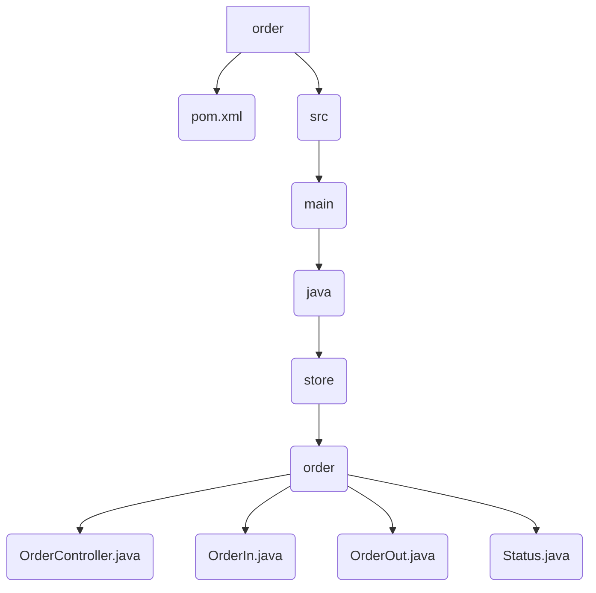

# Order

This is the interface for the Order service. It defines the API for managing user orders.

## File Structure



## Source Code

### pom.xml

```xml
<?xml version="1.0" encoding="UTF-8"?>
<project xmlns="http://maven.apache.org/POM/4.0.0" xmlns:xsi="http://www.w3.org/2001/XMLSchema-instance"
	xsi:schemaLocation="http://maven.apache.org/POM/4.0.0 https://maven.apache.org/xsd/maven-4.0.0.xsd">
	<modelVersion>4.0.0</modelVersion>
	<parent>
		<groupId>org.springframework.boot</groupId>
		<artifactId>spring-boot-starter-parent</artifactId>
		<version>3.5.5</version>
		<relativePath/>
	</parent>

	<groupId>store</groupId>
	<artifactId>order</artifactId>
	<version>1.0.0</version>
	
	<properties>
		<java.version>21</java.version>
		<spring-cloud.version>2025.0.0</spring-cloud.version>
		<maven.compiler.proc>full</maven.compiler.proc>
	</properties>

	<dependencies>
		<dependency>
			<groupId>org.springframework.boot</groupId>
			<artifactId>spring-boot-starter-web</artifactId>
		</dependency>

		<dependency>
			<groupId>org.springframework.cloud</groupId>
			<artifactId>spring-cloud-starter-openfeign</artifactId>
		</dependency>

		<dependency>
			<groupId>org.projectlombok</groupId>
			<artifactId>lombok</artifactId>
			<optional>true</optional>
		</dependency>

		<dependency>
			<groupId>${project.groupId}</groupId>
			<artifactId>product</artifactId>
			<version>${project.version}</version>
		</dependency>
		
	</dependencies>

	<dependencyManagement>
		<dependencies>
			<dependency>
				<groupId>org.springframework.cloud</groupId>
				<artifactId>spring-cloud-dependencies</artifactId>
				<version>${spring-cloud.version}</version>
				<type>pom</type>
				<scope>import</scope>
			</dependency>
		</dependencies>
	</dependencyManagement>

</project>
```

### OrderController.java

```java
package store.order;

import java.util.List;

import org.springframework.cloud.openfeign.FeignClient;
import org.springframework.http.ResponseEntity;
import org.springframework.web.bind.annotation.GetMapping;
import org.springframework.web.bind.annotation.PathVariable;
import org.springframework.web.bind.annotation.PostMapping;
import org.springframework.web.bind.annotation.RequestBody;
import org.springframework.web.bind.annotation.RequestHeader;

@FeignClient(name = "order", url = "http://order:8080")
public interface OrderController {

    @PostMapping("/order")
    public ResponseEntity<OrderOut> create(
        @RequestHeader(value = "id-account", required = true) String idAccount,
        @RequestBody OrderIn in
    );

    @GetMapping("/order/{id}")
    public ResponseEntity<OrderOut> read(
        @RequestHeader(value = "id-account", required = true) String idAccount,
        @PathVariable("id") String id
    );

    @GetMapping("/order")
    public ResponseEntity<List<OrderOut>> readAll(
        @RequestHeader(value = "id-account", required = true) String idAccount
    );
    
}
```
