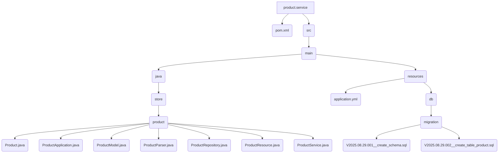

# Product Service

This is the implementation of the Product service. It handles the business logic for managing products.

## File Structure



## Source Code

### pom.xml

```xml
<?xml version="1.0" encoding="UTF-8"?>
<project xmlns="http://maven.apache.org/POM/4.0.0" xmlns:xsi="http://www.w3.org/2001/XMLSchema-instance"
	xsi:schemaLocation="http://maven.apache.org/POM/4.0.0 https://maven.apache.org/xsd/maven-4.0.0.xsd">
	<modelVersion>4.0.0</modelVersion>
	<parent>
		<groupId>org.springframework.boot</groupId>
		<artifactId>spring-boot-starter-parent</artifactId>
		<version>3.5.5</version>
		<relativePath/>
	</parent>

	<groupId>store</groupId>
	<artifactId>product-service</artifactId>
	<version>1.0.0</version>
	
	<properties>
		<java.version>21</java.version>
		<spring-cloud.version>2025.0.0</spring-cloud.version>
		<maven.compiler.proc>full</maven.compiler.proc>
	</properties>

	<dependencies>
		<dependency>
			<groupId>org.springframework.boot</groupId>
			<artifactId>spring-boot-starter-web</artifactId>
		</dependency>

		<dependency>
			<groupId>org.springframework.boot</groupId>
			<artifactId>spring-boot-starter-data-jpa</artifactId>
	    </dependency>

		<dependency>
			<groupId>${project.groupId}</groupId>
			<artifactId>product</artifactId>
			<version>${project.version}</version>
		</dependency>

		<!-- https://mvnrepository.com/artifact/org.projectlombok/lombok -->
		<dependency>
			<groupId>org.projectlombok</groupId>
			<artifactId>lombok</artifactId>
			<optional>true</optional>
		</dependency>

		<dependency>
			<groupId>org.postgresql</groupId>
			<artifactId>postgresql</artifactId>
			<scope>runtime</scope>
	    </dependency>
		<dependency>
			<groupId>org.flywaydb</groupId>
			<artifactId>flyway-core</artifactId>
		</dependency>
		<dependency>
			<groupId>org.flywaydb</groupId>
			<artifactId>flyway-database-postgresql</artifactId>
		</dependency>


	</dependencies>

	<dependencyManagement>
		<dependencies>
			<dependency>
			<groupId>org.springframework.cloud</groupId>
			<artifactId>spring-cloud-dependencies</artifactId>
			<version>${spring-cloud.version}</version>
				<type>pom</type>
				<scope>import</scope>
			</dependency>
		</dependencies>
	</dependencyManagement>

	<build>
		<plugins>
			<plugin>
				<groupId>org.springframework.boot</groupId>
				<artifactId>spring-boot-maven-plugin</artifactId>
				<configuration>
					<excludes>
						<exclude>
							<groupId>org.projectlombok</groupId>
							<artifactId>lombok</artifactId>
						</exclude>
					</excludes>
				</configuration>
			</plugin>
		</plugins>
	</build>

</project>
```

### ProductService.java

```java
package store.product;

import java.util.List;
import java.util.stream.StreamSupport;

import org.springframework.beans.factory.annotation.Autowired;
import org.springframework.http.HttpStatus;
import org.springframework.stereotype.Service;
import org.springframework.web.server.ResponseStatusException;


@Service
public class ProductService {

    @Autowired
    private ProductRepository productRepository;

    public Product create(Product product) {
        if (product.name() == null || product.name().trim().isEmpty()) {
            throw new ResponseStatusException(HttpStatus.BAD_REQUEST, "Product name is mandatory.");
        }

        if (product.price() == null) {
            throw new ResponseStatusException(HttpStatus.BAD_REQUEST, "Product price is mandatory.");
        }

        if (productRepository.findByName(product.name()) != null) {
            throw new ResponseStatusException(HttpStatus.BAD_REQUEST, "Product name already registered.");
        }

        ProductModel savedModel = productRepository.save(new ProductModel(product));
        return savedModel.to();
    }

    public List<Product> findAll() {
        return StreamSupport.stream(productRepository.findAll().spliterator(), false)
                .map(ProductModel::to)
                .toList();
    }

    public Product findById(String id) {
        return productRepository.findById(id)
                .map(ProductModel::to)
                .orElseThrow(() -> new ResponseStatusException(HttpStatus.NOT_FOUND, "Product not found."));
    }

    public void delete(String id) {
        if (!productRepository.existsById(id)) {
            throw new ResponseStatusException(HttpStatus.NOT_FOUND, "Product not found.");
        }
        productRepository.deleteById(id);
    }
}
```
