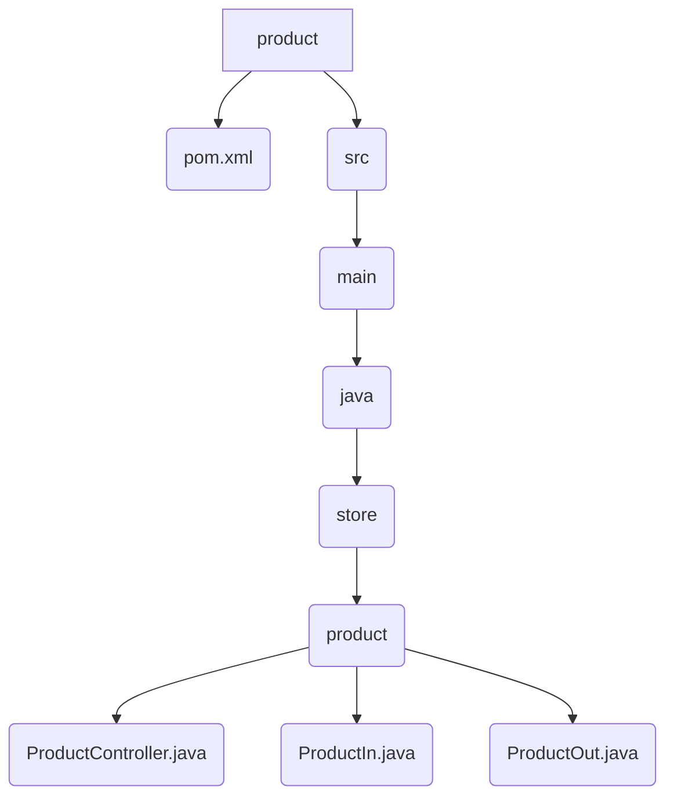

# Product API

This document details the API for the Product microservice, which is responsible for managing products in the system.

## Endpoints

The following endpoints are available for interacting with the Product service.

!!! info "POST /product"
    Creates a new product.

    === "Request"
        ```json
        {
          "name": "Soybean",
          "price": 25.50,
          "unit": "Ton"
        }
        ```

    === "Response: 201 Created"
        ```json
        {
          "id": "a2a9a74f-8265-4b6c-a43a-7d3c8cb2f6c4",
          "name": "Soybean",
          "price": 25.50,
          "unit": "Ton"
        }
        ```

---

!!! info "GET /product"
    Retrieves a list of all products.

    === "Response: 200 OK"
        ```json
        [
          {
            "id": "a2a9a74f-8265-4b6c-a43a-7d3c8cb2f6c4",
            "name": "Soybean",
            "price": 25.50,
            "unit": "Ton"
          },
          {
            "id": "b3b0b85g-9376-5c7d-b54b-8e4d9dc3g7d5",
            "name": "Corn",
            "price": 15.75,
            "unit": "Ton"
          }
        ]
        ```

---

!!! info "GET /product/{id}"
    Retrieves a single product by its unique ID.

    === "Response: 200 OK"
        ```json
        {
          "id": "a2a9a74f-8265-4b6c-a43a-7d3c8cb2f6c4",
          "name": "Soybean",
          "price": 25.50,
          "unit": "Ton"
        }
        ```
    === "Response: 404 Not Found"
        ```json
        {
            "timestamp": "2025-10-27T10:30:00.123+00:00",
            "status": 404,
            "error": "Not Found",
            "message": "Product not found!",
            "path": "/product/c4c1c96h-0487-6d8e-c65c-9f5e0ed4h8e6"
        }
        ```

---

!!! info "GET /product/search/{name}"
    Searches for products with a name containing the provided string.

    === "Response: 200 OK"
        ```json
        [
          {
            "id": "a2a9a74f-8265-4b6c-a43a-7d3c8cb2f6c4",
            "name": "Soybean",
            "price": 25.50,
            "unit": "Ton"
          }
        ]
        ```

---

!!! info "DELETE /product/{id}"
    Deletes a product by its unique ID.

    === "Response: 204 No Content"
        (No response body)

## File Structure



## Source Code

### ProductController.java

```java
package store.product;

import java.util.List;

import org.springframework.cloud.openfeign.FeignClient;
import org.springframework.http.ResponseEntity;
import org.springframework.web.bind.annotation.DeleteMapping;
import org.springframework.web.bind.annotation.GetMapping;
import org.springframework.web.bind.annotation.PathVariable;
import org.springframework.web.bind.annotation.PostMapping;
import org.springframework.web.bind.annotation.RequestBody;

@FeignClient(name = "product", url = "http://product:8080")
public interface ProductController {
    
    @PostMapping("/product")
    public ResponseEntity<ProductOut> create(
        @RequestBody ProductIn in
    );

    @GetMapping("/product/{id}")
    public ResponseEntity<ProductOut> findById(
        @PathVariable("id") String id
    );

    @GetMapping("/product")
    public ResponseEntity<List<ProductOut>> findAll();

    @GetMapping("/product/search/{name}")
    public ResponseEntity<List<ProductOut>> findByName(
        @PathVariable("name") String name
    );

    @DeleteMapping("/product/{id}")
    public ResponseEntity<Void> delete(
        @PathVariable("id") String id
    );

}
```

### ProductIn.java

```java
package store.product;

import lombok.Builder;

@Builder
public record ProductIn(
    String name,
    Double price,
    String unit
) {}
```

### ProductOut.java

```java
package store.product;

import lombok.Builder;

@Builder
public record ProductOut(
    String id,
    String name,
    Double price,
    String unit
) {}
```
