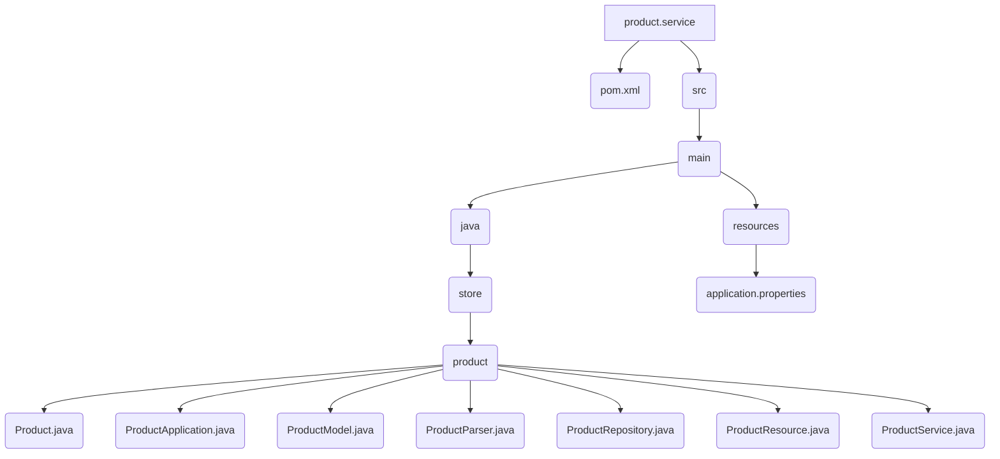

# Product Service

This is the implementation of the Product service. It handles the business logic for managing products, including creation, retrieval, and deletion.

## File Structure



## Business Logic

The `ProductService` class contains the core business logic for the application. Here are the key operations:

- **`create(Product product)`**: Validates that `name`, `price`, and `unit` are not null. It also checks if a product with the same name already exists to prevent duplicates. If all checks pass, it saves the new product to the database.
- **`findAll()`**: Retrieves all products from the database.
- **`findById(String id)`**: Finds a single product by its ID.
- **`findByName(String name)`**: Performs a search for products whose names contain the given search string.
- **`delete(String id)`**: Deletes a product by its ID, throwing an exception if the product does not exist.

## Source Code

### ProductService.java

```java
package store.product;


import java.util.List;
import java.util.stream.StreamSupport;

import org.springframework.beans.factory.annotation.Autowired;
import org.springframework.http.HttpStatus;
import org.springframework.stereotype.Service;
import org.springframework.web.server.ResponseStatusException;

@Service
public class ProductService {

    @Autowired
    private ProductRepository productRepository;

    public Product create(Product product) {
        if (null == product.name()) {
            throw new ResponseStatusException(HttpStatus.BAD_REQUEST,
                "Name is mandatory!"
            );
        }
        // clean special caracters
        product.name(product.name().trim());

        if (null == product.price()) {
            throw new ResponseStatusException(HttpStatus.BAD_REQUEST,
                "Price is mandatory!"
            );
        }

        if (null == product.unit()) {
            throw new ResponseStatusException(HttpStatus.BAD_REQUEST,
                "Unit is mandatory!"
            );
        }

        // if not Optional.empty
        if (productRepository.findByName(product.name()).isPresent()) {
            throw new ResponseStatusException(HttpStatus.BAD_REQUEST,
                "Name already have been registered!"
            );
        }

        return productRepository.save(
            new ProductModel(product)
        ).to();
    }

    public List<Product> findAll() {
        return StreamSupport.stream(
            productRepository.findAll().spliterator(), false)
            .map(ProductModel::to)
            .toList();
    }

    public Product findById(String id) {
        return productRepository.findById(id).map(ProductModel::to).orElse(null);
    }

    public List<Product> findByName(String name) {
        return StreamSupport.stream(
            productRepository.findByNameContaining(name).spliterator(), false)
            .map(ProductModel::to)
            .toList();
    }

    public void delete(String id) {
        productRepository.delete(productRepository.findById(id).orElseThrow(() ->
            new ResponseStatusException(HttpStatus.NOT_FOUND, "Product not found!")
        ));
    }
}
```
